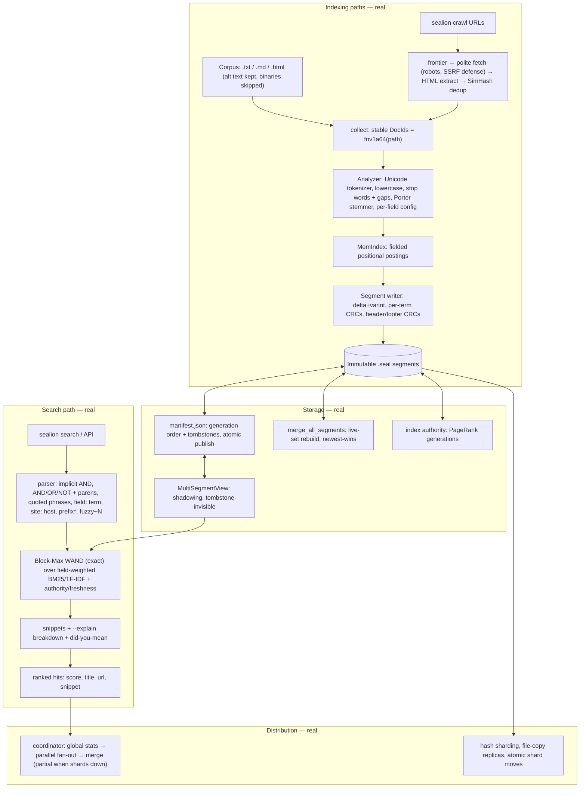

<h1 align="center">SeaLion</h1>
<p align="center"><strong>A distributed full-text search engine built from first principles in Rust.</strong></p>
<p align="center">
  <a href="https://github.com/tmarhguy/sealion-search-engine/actions/workflows/ci.yml"></a>
  <a href="docs/architecture.md"></a>
  <a href="#tests-155-passing"></a>
  <a href="https://www.rust-lang.org/"></a>
  <a href="#license-and-author"></a>
</p>

SeaLion is a search engine built the hard way: its analysis, inverted
index, segments, compression, and ranking are implemented directly, not
delegated to an existing engine. No Lucene, no Elasticsearch, no
OpenSearch, no Solr, no Meilisearch, no Typesense.

Honest status: milestones 01–20 are done — a working system, not a
roadmap. The engine analyzes text, ranks with field-aware BM25 over
immutable versioned segments, skips with exact Block-Max WAND, tolerates
typos with BK-tree correction, crawls politely with HTML/image-alt
extraction, measures relevance (nDCG@10 = 0.9314 seed), shards and
replicates with failover, and serves JSON + a search page over HTTP.
Measured (release): 5114 docs/s indexing, 271 qps exact WAND search.
The one real gap: the product UI is a dependency-free search page, not
the React/TypeScript build (§78) — it consumes the same `/api/*`
contract the React app will use. This README describes only what is in
the working tree.

**Explore:** [architecture](docs/architecture.md) ·
[segment format](docs/index-format.md) ·
[ADRs](docs/adr/) ·
[CLI](#see-it-run-it-inspect-it)

## Architecture at a glance

All boxes run — indexing, storage, search, crawl, distribution, product:



Segment byte layout (`docs/index-format.md`):

```text
+-------------------------------+
| header                  60 B  |  magic SEALION1, version 1, flags, counts, offsets, header CRC
+-------------------------------+
| postings + positions blocks   |  delta+varint DocIDs + gapped positions, per-term CRCs
+-------------------------------+
| dictionary  (count + entries) |  sorted by (field, term): offsets, df, first/last doc, CRCs
+-------------------------------+
| document metadata (stored)    |  DocID + JSON Document per doc
+-------------------------------+
| statistics                    |  per-field token totals (BM25 avgdl inputs)
+-------------------------------+
| footer                  16 B  |  magic + file CRC32
+-------------------------------+
```

## Authority and state boundaries

- **Edit:** `docs/architecture.md`, `docs/index-format.md`,
  `docs/adr/`, crate sources, `evaluation/`. These are the authorities
  for implemented behavior: they describe what the repository actually
  proves, not what is planned.
- **Spec:** the full §0–119 requirements live outside this repo
  (`file.md` working copy); section references like `(§26)` point at it.
- **Runtime state:** there is exactly one mutable file,
  `<data-dir>/manifest.json` (`{ generation, segments, deleted }`).
  Segments (`seg-*.seal`) are immutable once published. Readers verify
  checksums on open; a crash before the atomic manifest rename leaves
  the old generation untouched.

## What's real

| Piece | Where | State |
|---|---|---|
| Document model (`Document`, 4 fields, stable `DocId`) + validated TOML config + typed errors | [`crates/sealion-core/src/`](crates/sealion-core/src/) | done, tested |
| Text analysis: Unicode-alphanumeric tokenizer, case folding, English stop words with position gaps, hand-rolled Porter stemmer (matches Porter's published vocabulary), per-field overrides, gapped positional terms | [`crates/sealion-index/src/analysis.rs`](crates/sealion-index/src/analysis.rs), [`stemmer.rs`](crates/sealion-index/src/stemmer.rs) | done, tested |
| In-memory fielded positional index (`MemIndex`), sorted postings, replace-on-re-add, `IndexView` trait unifying memory and disk | [`crates/sealion-index/src/mem_index.rs`](crates/sealion-index/src/mem_index.rs), [`view.rs`](crates/sealion-index/src/view.rs) | done, tested |
| Query AST: `Term`, `Phrase`, `Prefix`, `Fuzzy`, `Site`, `And`/`Or`/`Not`, all normalized through the index pipeline | [`crates/sealion-query/src/query.rs`](crates/sealion-query/src/query.rs) | done, tested |
| Query parser: implicit AND, explicit `AND`/`OR`/`NOT` + parens (`NOT` > `AND` > `OR`), `"quoted phrases"` (bare or `title:"..."`), `field:term`, `site:host`, `prefix*`, `term~N`, `max_query_terms` limit | [`crates/sealion-query/src/parser.rs`](crates/sealion-query/src/parser.rs) | done, tested |
| Boolean execution: sorted/galloping intersection, union, difference, phrase position checks, prefix/fuzzy/site evaluation | [`crates/sealion-query/src/execute.rs`](crates/sealion-query/src/execute.rs) | done, tested |
| Reference oracle: exhaustive scan-over-documents engine; indexed search must agree on every query shape | [`crates/sealion-query/src/reference.rs`](crates/sealion-query/src/reference.rs) | done, tested |
| Persistent segments: versioned `.seal` files, crash-safe tmp→fsync→verify→rename publication, atomic manifest, verified reader, corruption-as-error | [`crates/sealion-index/src/segment/`](crates/sealion-index/src/segment/) | done, tested |
| Postings compression: delta+varint DocIDs and positions, raw-layout baseline, measured codec + segment benchmarks (1.0–1.6 B/posting; demo segment 46.8% of raw) | [`crates/sealion-index/src/codec.rs`](crates/sealion-index/src/codec.rs) | done, tested |
| Generations + merging: manifest-ordered segments, newest-wins shadowing, manifest tombstones, `index merge` / `index delete`, `merge == clean rebuild` | [`crates/sealion-index/src/merge.rs`](crates/sealion-index/src/merge.rs), [`view.rs`](crates/sealion-index/src/view.rs) | done, tested |
| BM25 ranking: positive `ln(1 + (N-df+0.5)/(df+0.5))` IDF, `k1=1.2 b=0.75`, field weights (title 4.0 / heading 2.0 / body 1.0 / anchor 1.5), generation-correct stats, exhaustive top-k (score desc, DocId asc), snippets, `--explain` | [`crates/sealion-query/src/rank.rs`](crates/sealion-query/src/rank.rs) | done, tested |
| WAND top-k: textbook pivot loop + Block-Max whole-block jumps, `EPS`-safe ties, `--exhaustive` baseline, scored/skipped counters | [`crates/sealion-query/src/wand.rs`](crates/sealion-query/src/wand.rs) | done, tested, exact (§41) |
| Typo/autocomplete: BK-tree corrections (exact vs naive scan), ranked completions, `complete`, did-you-mean | [`crates/sealion-query/src/spell.rs`](crates/sealion-query/src/spell.rs) | done, tested |
| Advanced ranking: TF-IDF/BM25 switch, PageRank authority (`index authority`), freshness decay, measured ablations | [`crates/sealion-query/src/rank.rs`](crates/sealion-query/src/rank.rs), [`crates/sealion-index/src/authority.rs`](crates/sealion-index/src/authority.rs) | done, tested |
| Crawler: persistent frontier, politeness + robots + SSRF defense, canonicalization, exact/SimHash dedup, HTML + img-alt extraction, `sealion crawl` | [`crates/sealion-crawler/src/`](crates/sealion-crawler/src/) | done, tested live |
| Relevance: graded judgments, nDCG@10/MRR/MAP, save/baseline regression gate, seed set at nDCG@10 = 0.9314 | [`crates/sealion-eval/src/`](crates/sealion-eval/src/), [`evaluation/`](evaluation/) | done, tested |
| Distribution: hash sharding, global-stats coordinator (exact vs single), replicas + failover routing, partial semantics, atomic moves | [`crates/sealion-distributed/src/`](crates/sealion-distributed/src/) | done, tested |
| Caches + benches: postings/length memos, LRU query cache, `bench query` (mix + ablation + cache) / `bench index` | [`crates/sealion-bench/src/`](crates/sealion-bench/src/) | done, measured |
| Adversarial: randomized properties, garbage suites, per-region corruption, failure injection, soak smoke | `tests/properties.rs`, `tests/adversarial.rs`, `tests/failure.rs` per crate | done, tested |
| HTTP API: axum `/api/search` (trace timings, partial), `/api/complete`, admin status/metrics with token gate, static search page, `sealion serve` | [`crates/sealion-api/src/`](crates/sealion-api/src/) | done, tested live |
| CLI: `index`, `search [--explain]`, `complete`, `crawl`, `cluster/shard/node`, `eval`, `bench`, `serve`, `index stats\|verify\|merge\|delete\|authority` — no stubs remain | [`crates/sealion-cli/src/`](crates/sealion-cli/src/) | done, tested |

Shipped: the §112 flagship demo runs end-to-end (search → explain →
typo → phrase → WAND ablation → nDCG → kill-replica → add-doc → move).
Hybrid vector retrieval was evaluated and explicitly deferred (ADR-018):
no embedding runtime, no judgment scale, lexical headroom remains.

## See it, run it, inspect it

```bash
cargo build --workspace

# Index a local corpus (.txt/.md/.html; binaries counted and skipped)
./target/debug/sealion index ./evaluation/corpus --data-dir ./sealion-data

# Search: BM25 + exact Block-Max WAND, snippets, did-you-mean
./target/debug/sealion search "distributed systems" --data-dir ./sealion-data

# Phrase + explain (per-term tf/df/idf/len/avg/contrib)
./target/debug/sealion search '"distributed systems"' --explain --data-dir ./sealion-data

# Typo tolerance + autocomplete
./target/debug/sealion search "distribted databse" --data-dir ./sealion-data
./target/debug/sealion complete comp --data-dir ./sealion-data

# Crawl the web (robots, delays, dedup) straight into the index
./target/debug/sealion crawl https://example.org --depth 2 --pages 100 --data-dir ./sealion-data

# Cluster: 4 shards × 2 replicas, then the same index/search commands
./target/debug/sealion cluster init --shards 4 --replicas 2 --data-dir ./cluster-data
./target/debug/sealion index ./evaluation/corpus --data-dir ./cluster-data
./target/debug/sealion search "compiler" --data-dir ./cluster-data
./target/debug/sealion cluster status --data-dir ./cluster-data

# Relevance gate + benchmarks + serve
./target/debug/sealion eval relevance --save new.json --baseline old.json
./target/debug/sealion bench query --rounds 3 --cache --data-dir ./sealion-data
./target/debug/sealion serve --bind 127.0.0.1:8080 --data-dir ./sealion-data

# Introspect and maintain the index
./target/debug/sealion index stats --data-dir ./sealion-data
./target/debug/sealion index verify --data-dir ./sealion-data
./target/debug/sealion index delete 12345 --data-dir ./sealion-data
./target/debug/sealion index merge --data-dir ./sealion-data
./target/debug/sealion index authority --data-dir ./sealion-data
```

Same gate as CI:

```bash
cargo fmt --all -- --check
cargo clippy --workspace --all-targets -- -D warnings
cargo test --workspace
```

> macOS note: the default toolchain on this machine ships a
> `MacOSX27.0.sdk` its bundled linker cannot parse, so plain
> `cargo build` fails with `unknown architecture arm64e.x1-macos`.
> Until the toolchain is updated, prefix cargo commands with
> `SDKROOT=/Library/Developer/CommandLineTools/SDKs/MacOSX15.4.sdk`.
> CI (`ubuntu-latest`) is unaffected.

## Tests (155 passing)

Tests live next to the code — unit tests in `src/` files,
integration gates in `tests/`. CI runs all of this on every push
([workflow](.github/workflows/ci.yml)).

| File | What it proves |
|---|---|
| [`sealion-core`](crates/sealion-core/src/) | config defaults/validation/rejection (incl. ranking knobs), document JSON roundtrip, field order |
| [`sealion-index`](crates/sealion-index/src/) | analysis + positions, stemmer vs published vocabulary, codec roundtrips + corruption rejection, dictionary ordering/scoping, mem-index shape, merge/newest-wins/tombstones, PageRank order, manifest atomicity, reader truncation/unknown-field rejection, posting/length memos |
| [`sealion-query`](crates/sealion-query/src/) | Boolean identities + spec examples, galloping == linear, prefix/fuzzy/site agree with oracle, parser operators/precedence/phrases/limits (+2000 garbage inputs), BM25/TF-IDF ordering, authority/freshness math, snippets, cache gating/LRU, WAND == exhaustive incl. blends, oracle agreement on generated corpora |
| [`sealion-crawler`](crates/sealion-crawler/src/) | canonicalization merges/dedups, robots groups/rules, SimHash operating point, frontier fairness/persistence, HTML extraction + boilerplate suppression, garbage HTML never panics |
| [`sealion-distributed`](crates/sealion-distributed/src/) | shard assignment stability, offline detection, round-robin/least-outstanding routing |
| [`sealion-eval`](crates/sealion-eval/src/) | nDCG/MRR/AP math, report + regression, loader rejection |
| [`tests/compression_bench.rs`](crates/sealion-index/tests/compression_bench.rs) | measured bytes/posting report, compressed < raw |
| [`tests/generations.rs`](crates/sealion-index/tests/generations.rs) | merge == clean rebuild, tombstone hides then merge drops, updates never resurrect stale terms |
| [`tests/properties.rs`](crates/sealion-index/tests/properties.rs) | random ADD/UPDATE/DELETE sequences == clean rebuild (membership, postings, tombstones, merge) |
| [`tests/adversarial.rs`](crates/sealion-index/tests/adversarial.rs) | garbage/truncated segments rejected, per-region corruption detected, codec garbage safe, manifest garbage rejected |
| [`tests/failure.rs`](crates/sealion-index/tests/failure.rs) | unwritable dir fails cleanly, failed merge keeps old generation, tombstone survives crash (+ ignored soak) |
| [`tests/segment_roundtrip.rs`](crates/sealion-index/tests/segment_roundtrip.rs) | every posting list survives a roundtrip, bit flips detected, failed publication leaves nothing visible |
| [`tests/boolean_reference.rs`](crates/sealion-query/tests/boolean_reference.rs) | indexed search == oracle on every query shape, incremental indexing == rebuild, deletes never appear |
| [`tests/compression_segments.rs`](crates/sealion-query/tests/compression_segments.rs) | compressed segment search report |
| [`tests/phrase_rank.rs`](crates/sealion-query/tests/phrase_rank.rs) | phrase index == positional oracle, positional invariant on randomized docs, ranked output is score-ordered |
| [`tests/segment_search.rs`](crates/sealion-query/tests/segment_search.rs) | segment search == memory on both layouts, multi-segment union == single index |
| [`tests/wand_segments.rs`](crates/sealion-query/tests/wand_segments.rs) | WAND == exhaustive on segments and across generations (updates, tombstones) |
| [`tests/adversarial.rs`](crates/sealion-query/tests/adversarial.rs) | parser/BK-tree/Levenshtein on garbage, capped-distance agreement |
| [`tests/local_crawl.rs`](crates/sealion-crawler/tests/local_crawl.rs) | live crawl: robots deny, redirects, depth caps, binary skip, alt text, dedup |
| [`tests/cluster_equivalence.rs`](crates/sealion-distributed/tests/cluster_equivalence.rs) | cluster == single index, partial on dead shard, transparent single-copy failover, moves preserve results |
| [`tests/serve.rs`](crates/sealion-api/tests/serve.rs) | live API: search/complete/status/metrics contract, admin token gate |

## Index integrity and ranking in one paragraph

A document is searchable if and only if its segment is listed in
`manifest.json`. Publication writes to a temp file, fsyncs, re-reads
and verifies it, then atomically renames it into place — a crash
leaves the previous generation intact and any orphan temp file
ignored. Every header, postings block, dictionary entry, and file
carries a CRC32; readers reject unknown versions, unknown flag bits,
truncation, and single-bit corruption as errors rather than
misreading. Ranking is exhaustive field-weighted BM25 over the live
set (tombstones and shadowed versions excluded from `N`, `df`, and
length statistics), sorted by score then DocId — this exact ordering
is the §41 baseline every future skipping optimizer must reproduce.
Details: [segment format](docs/index-format.md),
[ADR 004](docs/adr/004-segments.md),
[ADR 005](docs/adr/005-postings-codec.md),
[ADR 006](docs/adr/006-generations-merge.md),
[ADR 007](docs/adr/007-bm25-ranking.md).

## Repository map

| Path | Purpose |
|---|---|
| [`docs/architecture.md`](docs/architecture.md) | System design, build order (§110–111), what's done vs next |
| [`docs/index-format.md`](docs/index-format.md) | Normative `.seal` byte layout |
| [`docs/adr/`](docs/adr/) | Architecture decision records (001–019) |
| [`docs/deployment-demo.md`](docs/deployment-demo.md) | $0 public demo plan (applies at milestones 19–20) |
| [`crates/sealion-core/`](crates/sealion-core/) | Document model, field taxonomy, config, errors |
| [`crates/sealion-index/`](crates/sealion-index/) | Analysis, mem-index, segments, dictionary, codec, merge, views |
| [`crates/sealion-query/`](crates/sealion-query/) | Query AST, parser, Boolean execution, reference oracle, BM25/TF-IDF rank, WAND, spell, snippets, query cache |
| [`crates/sealion-crawler/`](crates/sealion-crawler/) | Frontier, fetch + politeness, robots, canonicalization, dedup, HTML extraction |
| [`crates/sealion-eval/`](crates/sealion-eval/) | Judgments, nDCG/MRR/MAP, regression comparison |
| [`crates/sealion-distributed/`](crates/sealion-distributed/) | Sharding, coordinator, replicas + routing, rebalancing |
| [`crates/sealion-api/`](crates/sealion-api/) | HTTP search/complete/admin API + static search page |
| [`crates/sealion-bench/`](crates/sealion-bench/) | Query/index benchmark harnesses |
| [`crates/sealion-cli/`](crates/sealion-cli/) | `sealion` command-line interface |
| [`evaluation/`](evaluation/) | Corpus, queries, judgments (seed relevance set) |
| [`.github/workflows/ci.yml`](.github/workflows/ci.yml) | CI: fmt + clippy `-D warnings` + full test suite |

## Roadmap

Twenty milestones, worked in order
([build order](docs/architecture.md#build-order-110111)). This tree
completes **all 20**: analysis → memory index → segments → compression
→ generations → BM25 → query language → WAND → typos/autocomplete →
crawler → relevance science → distributed search → replicas →
rebalancing → profiling → adversarial testing → advanced ranking →
product (API + search page; React build is the documented remaining
slice of §78).

## Core rules

- Correctness first. Every search optimization is verified against the
  intentionally-slow reference engine (§26). Optimized top-k must
  equal exhaustive top-k (§41) unless a strategy is documented as
  approximate.
- Measured, not intuited. No optimization lands without a profile and
  a before/after benchmark; no ranking change lands without a
  relevance regression (§53); no number is published without being
  measured — unmeasured values are `TBD (unmeasured)`.
- Documented decisions. Important choices get an ADR in `docs/adr/`.
- Honest status. Roadmap items stay labeled roadmap; unverified claims
  stay out of docs and resumes.
- No engine smuggling (§2). Storage, consensus, and retrieval
  structures are ours; libraries may provide HTTP, TLS, async,
  HTML parsing, serialization, and metrics only.

## Documentation and history

Start with [`docs/architecture.md`](docs/architecture.md). Important
decisions get an ADR in [`docs/adr/`](docs/adr/). The spec section
numbers (§N) refer to the full requirements text. Commits look like
`index: ...`, `query: ...`, `docs: ...` — one piece of work each, so
the history reads like the build went.

## Documentation

Detailed architecture, implementation, verification, and technical
documentation is available in the project documentation.
The manual source lives in [`docs/index.adoc`](docs/index.adoc);
build the static site locally with `make docs` (requires Asciidoctor).

## License and author

TBD — to be chosen by the project owner before any public release
(intended: MIT OR Apache-2.0, matching FigDB/Lobster; infrastructure
libraries only — Tokio, serde, tracing, reqwest, scraper — no search
engine).

Search architecture and project by **Tyrone Marhguy**.
