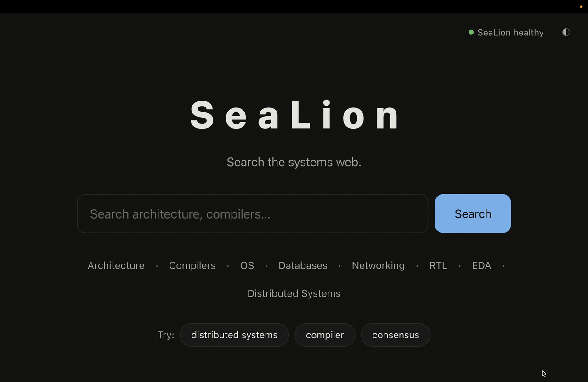

[#introduction]
== Introduction

This chapter defines what the system is, what this manual covers,
and how to navigate the rest of the document.

=== Purpose

SeaLion is a distributed full-text search engine built from first
principles in Rust.
Its analysis, inverted index, segments, compression, and ranking are
implemented directly — not delegated to an existing engine.

This manual is the engineering reference for that system.
It records design intent, interfaces, verification strategy,
on-disk detail, and measured behaviour in one numbered document.

=== Demo

.Demo — the search page answering a query with BM25-ranked hits

The recording shows what the system is: type a query in the search
page, get field-weighted BM25 hits with snippets back over HTTP.
The file lives at `media/demo/sealion-demo.gif` and is also embedded
at the top of `README.md`.

++++

<a href="https://sealion.tmarhguy.com" style="display:inline-block;background:#1d4e89;color:#ffffff;font-size:20px;font-weight:700;padding:14px 36px;border-radius:10px;text-decoration:none;margin:6px;">Try Live Search</a>
<a href="https://github.com/tmarhguy/sealion" style="display:inline-block;background:#24292f;color:#ffffff;font-size:20px;font-weight:700;padding:14px 36px;border-radius:10px;text-decoration:none;margin:6px;">GitHub Repository</a>

++++

=== Scope

The manual covers:

* system architecture and build order (see <<architecture,Architecture>>)
* core data structures and text analysis (see <<design,Design>>)
* command-line and file interfaces (see <<interfaces,Interfaces>>)
* the query model (see <<programming-model,Programming Model>>)
* correctness strategy (see <<verification,Verification>>)
* persistent layout and integrity (see <<implementation,Implementation>>)
* measured performance (see <<performance,Performance>>)
* honest limits (see <<limitations,Known Limitations>>)

It does not replace:

* `README.md` — quick start and repository map
* `docs/adr/` — architecture decision records behind individual choices
* crate-level rustdoc — API detail for a single module

=== How to read this manual

Read chapters in order the first time.
Chapters 1–2 give context; chapters 3–5 give the working model;
chapters 6–8 give the evidence that the system behaves as claimed.

Each chapter is self-contained enough to be entered directly from the
sidebar once the overview in <<architecture,Architecture>> is familiar.

=== Conventions

.Normal cross-reference and link usage
* Internal references look like this: <<verification,Verification>>.
* External links look like this: https://stnolting.github.io/neorv32/[NEORV32 documentation],
the visual reference for this manual's style.
* Inline code uses monospace, e.g. `sealion index`, `manifest.json`, `DocId`.
* File paths are repository-relative, e.g. `crates/sealion-index/src/merge.rs`.

.List conventions
* Unordered lists state properties or inventories.
* Ordered lists state procedures where sequence matters:

. Build the workspace.
. Index a corpus.
. Run a query and inspect the explanation.

NOTE: Honest status is a project rule.
Roadmap items stay labelled roadmap; unverified claims stay out of
this manual. Where a number has not been measured it is written
`TBD (unmeasured)`.

TIP: The sidebar on the left is collapsible.
Select a chapter title to navigate; select its arrow control to
expand or collapse its subsections without leaving the page.
